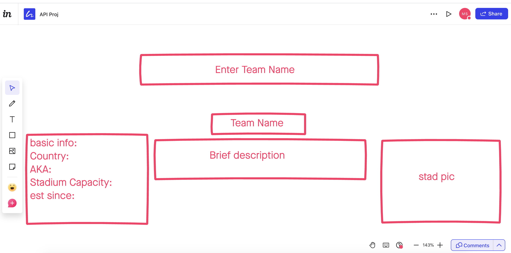

Team Data is the name of the app, it works on retrieving some information regarding the soccer team of choice by the user

☐ Technologies Used: HTML,CSS,Bootstrap JavaScript, Jquery 
☐ Screenshot(s):  
☐ Getting Started: https://github.com/moeabraham/module-1-proj 

☐ Technologies Used: HTML,CSS,Bootstrap JavaScript, Jquery
=======
☐ Screenshot(s): ![screenshot]
☐ Getting Started: https://moeabraham.github.io/module-1-proj/

☐ Future Enhancements: Functioning Local Storage/ Carousel.

Note: Don't underestimate the value of a well crafted README.md.
The README.mdintroduces your project to prospective employers and forms their first impression of your work!

