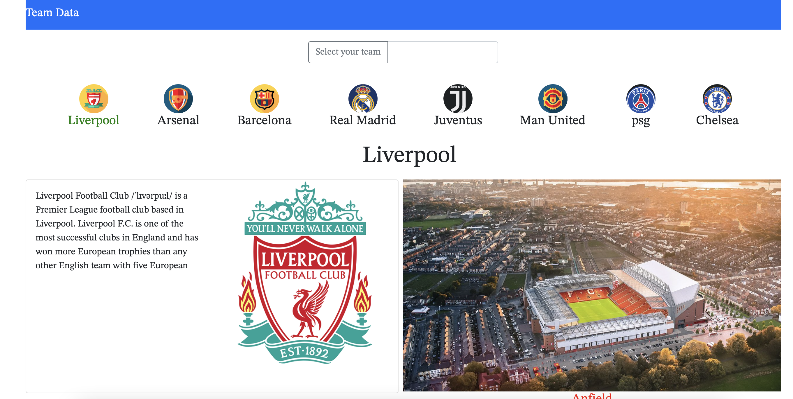
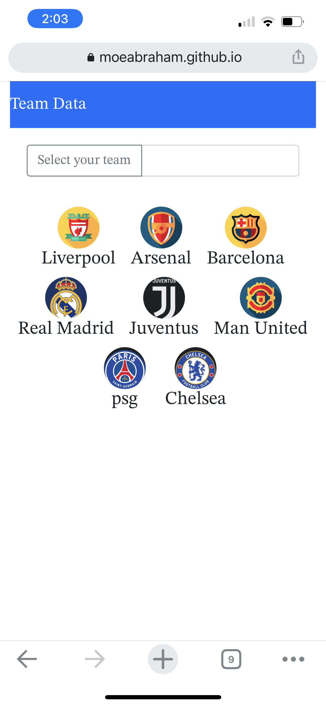

# Team Data 

Allows the user to get information regarding his favorite soccer team by using an API fetch call,

## Screenshots

# Technologies 

 - HTML
 - CSS
 - Bootstrap
 - JavaScript
 - Jquery 

 # Getting Started
 
  click here to get started  <https://github.com/moeabraham/module-1-proj>

  # Future enhancements

  - create an animated section with a carousel to show club's trophy 
  - add pages to compare stats using a different API
  - add audio tracks for the fans chants

